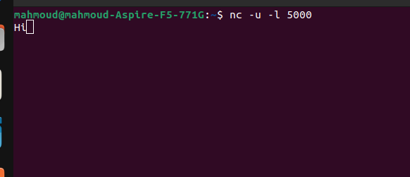
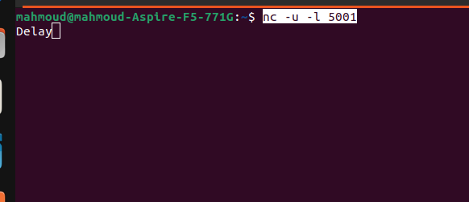
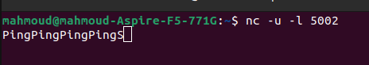

# quantum-systems_LinuxCase_Solution
this is the solution for challenge sent by quantumSystems

### the Cpp Task what the code do is:

- Starts two independent worker threads

- Each thread repeatedly runs a user-provided Process() function

- Each thread stops when either:
   - its Process() returns true (abort condition) or the timeout (10 seconds) is exceeded

- After both threads finish, main() prints how many loop iterations each thread completed

### the python task:
the rotation by 90 degree was wrong because the code overwrite the values.
### fix for the task:
- use transpose + reverse method

### Third Task:

